# **MMM** 

### Backend Development Milestone Project 3, using my own idea MMM = Mom's Micro Manager for the whole family and all the needs of one in a "simple" application.

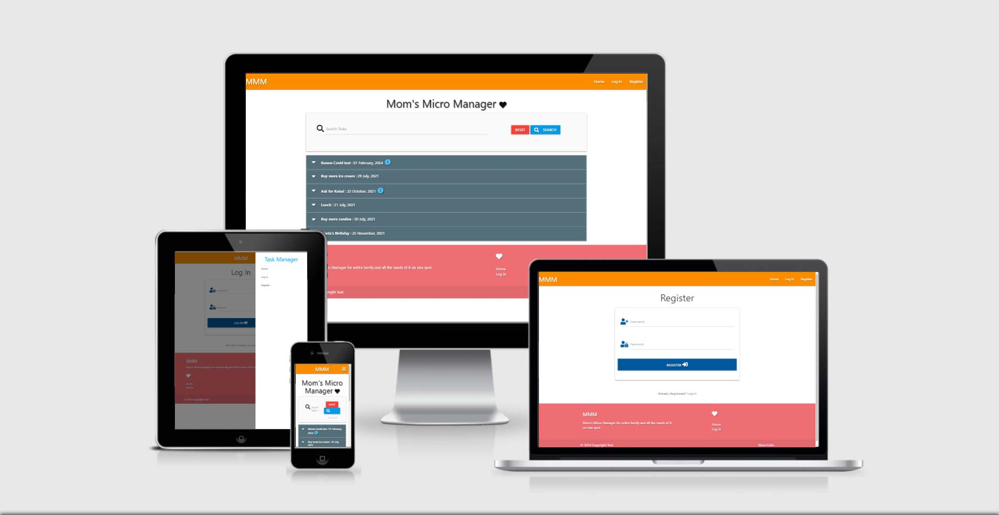 

###  *The live Website can be found [here.](https://flask-task-manager-cookbook.herokuapp.com/login)*
---
---
## **Content Tree**
---
---

- [UX](#ux)
    - [Idea](#idea)
    - [Owner goals](#owner-goals)
    - [User goals](#user-goals)
    - [Structure of the website](#structure-of-the-website)
    - [Wireframes](#wireframes)
    - [Surface](#surface)
    - [Database ](#database )
- [Features](#features)
  - [Game Page](#game-page)
  - [Features Left to Implement](#features-left-to-implement)
- [Technologies Used](#technologies-used)
- [Testing](#testing)
    - [Issues during codeing](#issues-during-coding)
    - [Compatibility testing](#compatibility-testing)
    - [Performance testing](#performance-testing)
- [Deployment](#deployment)
- [Credits](#credits)
    - [Acknowledgements](#acknowledgements)

---
---
## UX
---
---
### **Idea**
    In the beginning i wasn't sure what, how or where to start: since code it self was so overwelming 
    and still for me so hard to be abe to produce purly somehting on my own.

    after retrying for 2 time the same taks, i decided to go with mini project, and folowing step by step, 
    changing only stayling of it. the main core is the same as in mini project - Puting It All Togheter.

    So since my entire reason to start doing coding was to be able to start doing in game   development or 
    application development, i understand know that i need allot of practice in order to master all of the 
    interactions: JavaScript, Python+Flask, MongoDB, Heroku + CRUD functionality.
 
**But since this is my first MS3**, and it way more complicated and needs way more focus i needed a model 
    that i can follow and understand, so thats way i decided to go with mini project 'Puting It All Togheter' 
    as example.
      
    I try my best to not use same names as the source of my code, so by doing that i hope i avoid at least 
    some of related issues confronting forms about violation of use Plagiarism Policy.

    Satying that i was still not being able to digress far form core code = it so many tiny options to make a 
    mistake or simply typo mistakes and code isnt working again. 
## Owner goals
---
### Goal was to build simple task management for bigger and more active families that's it usually run by overwhelming moms with tons of each individual's needs and tasks on daily basis
* To increase the number of participants in MMM's daily tasking by providing 
  a simple, easy to use application.
* By doing that it easier to see biger picture, of immportance to each member
* Make easier day to day's taks in evrydays life of grown ups.
* Better control of your own time and all the task that we all need to perform on daily basis
* And by having happy customers who are using app, the distribution it will raise by it self thanks to happy Moms (Moms know the best)
---
## User goals
---
### As for user goals, it quite similar to the owners one!
   * fast and effective task manager for all genders, so it easy and simple to use
   * to have better control over you own time and entire family
   * simple and easy log in/out options
   * and simple and easy adding options for individualy tasks for each member
   * more free time and beter organization on using this managment system
   * the ability to log all family members to MMM, and simpler control of all tasks and prioritys from all members in the family
   * each member can make their own acc and add their own tasks cna be put to moms pending list

## **Structure of the website**
---
The task managment MMM is designed to be minimalistictic, with cleans and simple outlook. 
Inuitive and easy to understand.

It like a components in a wallet - purpose it not in aesthetics, but in brute function (even tho it can be done way more attractive - but in my case I stick to 'less it more')

## **Wireframes**
---
* I used website [Wireframe.cc](https://wireframe.cc/ob6oIW) to create a wireframes, with addition of Photoshop ofc.

Home
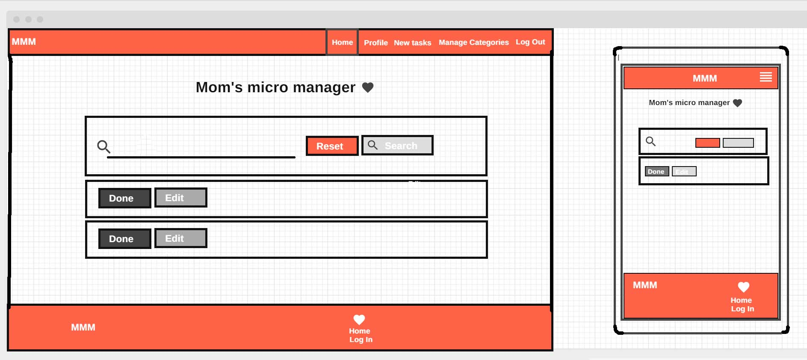  
Log in
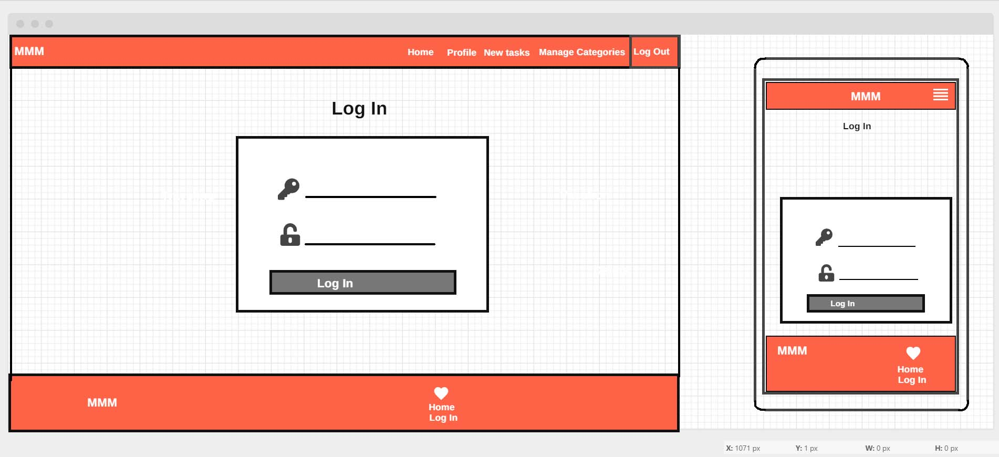
New task
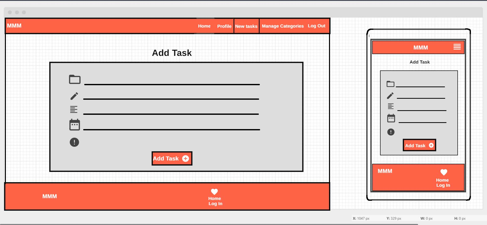  
Manage Categories
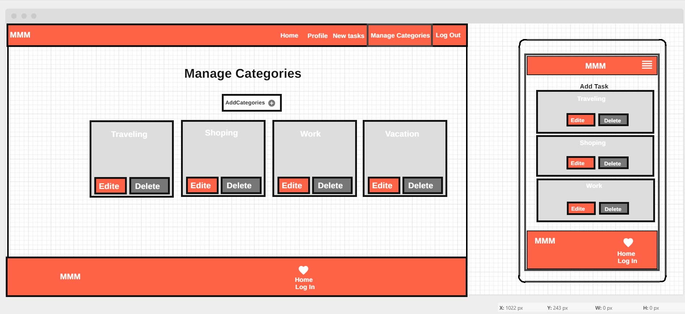

## **Surface**
---

### Colors
Main colours:
* trying to keep all in few tones
* header: orange darken-1 color with white text + text-shadow: 2px 2px 2px rgba(0, 0, 0, 0.5);
* 4 type of buttons: 

                     done - green
                     edite/add task - orange
                     reset/delete - red
                     research/add category - blue

* add task interface - gray
* footer = white-text + text-shadow on redish background color

### Fonts 
   1. font-family: -apple-system,BlinkMacSystemFont,"Segoe UI",Roboto,Oxygen-Sans,Ubuntu,Cantarell,"Helvetica Neue",sans-serif;
   
### Images

* Images will be all credite in [credits](#credits) section.

## **Database**
---

#### **MongoDB Object format examples**
  * **Task_manager:**
    * categories:
         
          {"_id":{"$oid":"60fe7a7d613e5116c1f03aa1"},"category_name":"Travel"}

          {"_id":{"$oid":"6102a1e82b30626e060a1f5f"},"category_name":"Vacations"}

          {"_id":{"$oid":"6102a20a2b30626e060a1f60"},"category_name":"Work"}

          {"_id":{"$oid":"6102a2292b30626e060a1f61"},"category_name":"Shopping"}

          {"_id":{"$oid":"6105562fd55e52a9a07566e8"},"category_name":"Family Time"}

          {"_id":{"$oid":"61055666d55e52a9a07566e9"},"category_name":"Nourishment"}
         
    * tasks:

          {"_id":{"$oid":"61576a99fe69251ceeb94d41"}"category_name":"Family Time"
          "task_name":"Sunday picnic "#"task_description":"bringing families together and talking about important topics "
          "is_urgent":"off"
          "due_date":"24 October, 2021"
          "created_by":"admin"}

    * users:

          {"_id":{"$oid":"61042b87bf3c483e7cae7850"},"username":"admin"
          "password":"pbkdf2:sha256:260000$lkEegMRa0Bs2CuwT$5a8552a52d31b7d99c24c8a1763d346b0f650510eeebce2736d90926fd9a7970"}

[Back to Content Tree](#content-tree)

---
---
## Features
---
---

### Build as Responsive app with MongoDB data (log in/out) 

#### **as Admin - Mom** 
*  As admin, you have access to all pages, and control over them, as well as making new category in each "New Task" with different needs for your Family
*  It build-in mind that one person keep all task in chek, like in real life.
*  As a admin you have options do edit or delete other tasks made by other users - in tihs case family members, when they are completed.

#### **as User - rest of family members** 
*  As User you have acces to all Home, Profile, New Taks and Log in/out options pages. 
*  Control over making new categorys in each "New Task" page, editing it and deliting it after we are done with same task.
*  As a User you dont have options do edit or delete other tasks made by other users - in tihs case family members (only Admin got have that options!)
*  As well as a user you can also ask your "Admin" or Mother/Father in rl. to make some new tasks that suit your needs. Keep in mind this is the only task manager to keeps track of all needs and activities in the family, it is not a replacement for not talking to your family members = it is an application that keep tracks of needs that you show digitaly to those who take care of you in those!
### The website contains 5 pages.

#### **Home page** 
*  page where you see all tasks done by everybody in family
#### **Profile page**
*  page where you chekc your profile 
#### **New Taks page**
*  page where you can add new task: pick category, add task name, add task description, pick date of task and marks it as important! 
#### **Manage Categories page**
*  page where you can add new category for your task page (only as Admin = in most cases that's Mom)
#### **Log Out/Log In page**
*  page for logging out and in on MMM using MongoDB databases to store information and user login/profile.

### **Features Left to Implement**
---

  * add more info to each profile page (photo and some additional "numbers" like axe, gender, date of birth, etc )
  * make it more apealing to generale taste - visualy speaking
  * adding gps navigation/location for each user
---
---
## **Technologies Used**
---
---
### **Core structure**
* HTML5

### **Style language**
* CSS

### **Interactions**
* JavaScript, Python+Flask, MongoDB, Heroku + CRUD functionality

### **Fonts**
### [Materialize](https://materializecss.com/about.html) 
* Font-family: -apple-system,BlinkMacSystemFont,"Segoe UI",Roboto,Oxygen-Sans,Ubuntu,Cantarell,"Helvetica Neue",sans-serif;   

### Wireframe.cc
* Making sketches and layout of the project.

### [Lighthouse](https://developers.google.com/web/tools/lighthouse)
* Tool to check performance of the website

### **Image editor**
* Photoshop
* [Am i responsive](http://ami.responsivedesign.is/#)

### **Storage**
* GitHub - As a software hosting platform to keep project in a remote location.

### **Coding platform**
* Gitpod - As a development hosting platform.

### **Deployment platform**
* Heroku - As a Deployment platform.

###  **The live Website can be found [here.](https://danthestar.github.io/MS3-cookbook/)**

[Back to Content Tree](#content-tree)

---
---
## **Testing**
---
---

### **Compatibility testing**
    Works with no bugs on all my laptops and smartphones in my family and beyond, 
    although we all have a samsung smartphone (some version and type)

### **Performance testing**

  I run [Lighthouse](https://developers.google.com/web/tools/lighthouse) tool to check performance of the website. Screenshots are presented below:

  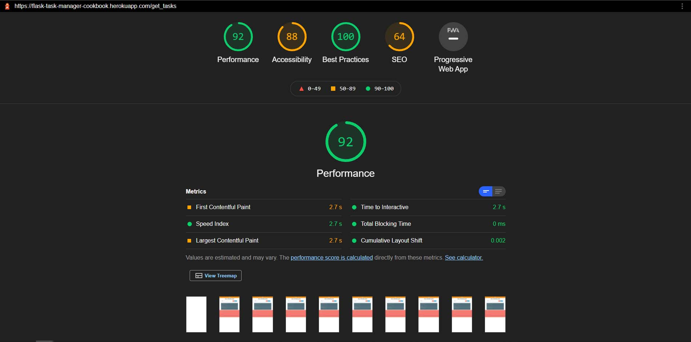

  
  #### I'm never on same page with accessibility vote, as artist and industrial designer i 
  do some things on purpose: for visual apealing or becouse of complementary contrast;
  even though i agree that i didnt do nothing specila with visual effects, but less it always more.

  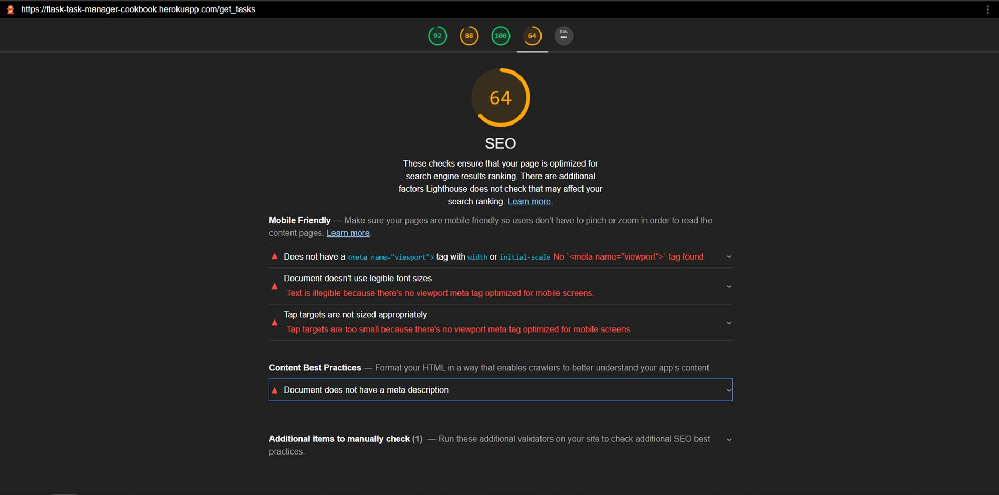

  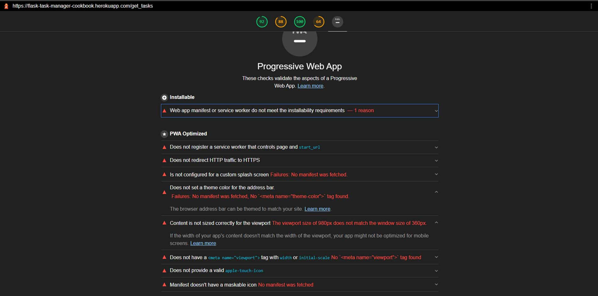

  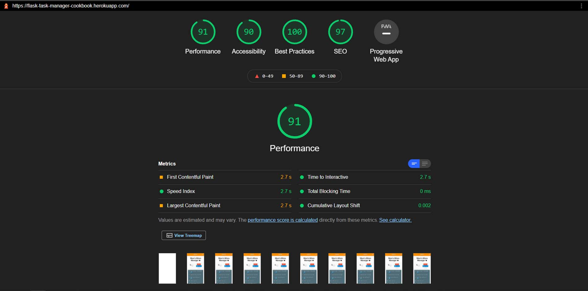

    Improvment in SEO department after including <meta name="description" content="xyz"> and <meta name="viewport" content="width=device-width, initial-scale=1">

  
### **Issues during site development**
---

    Main issue is stil typo mistakes   
    Some of them was me trying to figure it out, how is evrything behave in inspector view., example of grid system.

 ### On following "Mini Project | Putting It All Together" i run into small issues that didnt work opening my previw like this:

   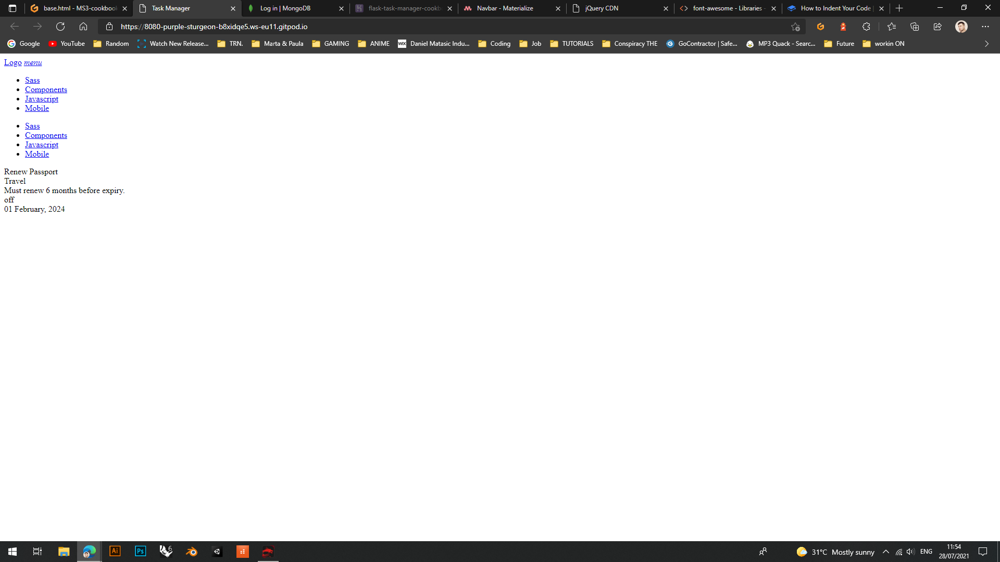
   
   #### Fixing issues
   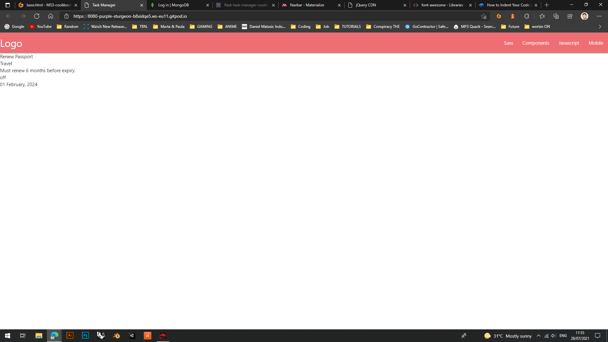
   #### **links are working [< cdnjs >](https://cdnjs.com/libraries/font-awesome)**

---
   
####  To complete this project I used Code Institute student template: [gitpod-full-template](https://github.com/Code-Institute-Org/gitpod-full-template)

* **jpg files** all my photos are Photoshoped after being downloaded form free source

    ,
          

[Back to Content Tree](#content-tree)

---
---
## **Deployment**
---
---
The project was deployed on GitHub Pages. I used Gitpod as a development environment where I commited all changes to github. I used "git commands" in Gitpod to save changes into GitHub and push site in public.
* ###   My site is published at https://danthestar.github.io/MS3-cookbook/
* ###  *The live Website can be found [here at heroku.com](https://flask-task-manager-cookbook.herokuapp.com/login)*

## Project construction
---
To create this project I followed the mandatory guide provided by Code Institute using the Gitpod Full Template, [this one here](https://github.com/Code-Institute-Org/gitpod-full-template) which is first step in creating any project.

On the page it self we ahve few options: we are only concern with the one that is in the shape of a button and says : **Use this template** button.

After clicking on the button we are moved to a new page, **'Create a new repository from gitpod-full-template'** - page where we put our desire name for Repository name of new project. We leave all others options as it is and click the green button at the bottom = **Create repository form template** to create "repo" form this template.

After creating my repo form template, we get generated new page on our (this case my GitHub account - [danthestar](https://github.com/danthestar)) with all preinstaled tools that we need for the project. And by clicking the green button **GitPod** our GitPod template will be open in a new GitPod = Workspace where we creatur aour projects.

By using Terminal comand we crate all of "folders and subfolders" and all other pages we need to store all of our individualy html codes, as well some of instalations to:

a) some of the frequently used commands:

    touch xy.xy = standard comand for making all new pages: html, py, etc.
    
    python3 app.py = to run application/code live in seperate browser or in same instance
    
    git status = to chek status of curent files - Whether your current branch is up to date or if there’s anything in the branch that needs to be committed, pushed, or pulled

    git add (file name)= adding single file to next commit comand

    git add -A = adding all the files to commit comand

    git commit -m "commit message" = it a save/chekpoint in coding, allso every time you commit your code changes, you’ll also include a message that briefly describe the changes you made

    git push = it a hard save on your GitHub, it will push all your changes that you saved and commited onto your Repo GitHub

    cleare = it will clear the terminal screen

    pkill -9 python3 = to terminate all terminal instaces

b) some of the one-time commands: 

    pip3 instatall Flask = set ups Flask function ready to be imported

    pip3 freez --local >xy.txt = it tell Heroku which applications and dependencies are required to run our app:

    echo web: python app.py > Procfile = the Procfile is what Heroku looks for to know which file runs the app, and how to run it

### **Deployment to Heroku**
---
After the "echo web: python app.py > Procfile" comand we can go to Heroku.com, and once we are logged in on your dashboard, we can click button new - and it will pop up 2 new sub options, we are picking: Createnew app

On filing rest of steps we got few options how to connect to our app, by using Heroku CLI or simpler version (automatically) we can pick GitHub version of connection to our repository.

I chose GitHub version, ehre as next step be sure to proper GitHub profile is displayed and then added my repository name
Click search button, after few seconds after finds my Repo click on button Connect.

Befor we procede we go to few more steps in Setings tab: 
  * Reveal Config Vars 
       
        KEY = IP and VALUE = 0.0.0.0
    click Add button for next step

        KEY = PORT and VALUE = 5000
    click Add button again for next one 

        KEY = SECRET_KEY and VALUE = (we copy that form env.py and paste it here)
    click Add button for next step

        KEY = MONGO_URI and VALUE = (we copy that form MongoDB under clusters/connect/connect to your application and submit the name and the password)  
    click Add button for next step

        KEY = MONGO_DBNAME and VALUE = (your database name)

    After setting up Config Vars we cna go back to Heroku and press Enable Automatic Deployment button.

    Click on next button under: Deploy Branch wait for few moments (while Heroku is receiving project from GitHub and building it)

    After a min or two you will see a new message with View button that says: 'Your app was succesfully deployed', click on to View button to lunch your app. This will eneble us to automatically update whenever we
    push changes to the GitHub repository.
---
---
## **Credits**
---
---

#### 

  ## [Back to Content Tree](#content-tree) 

### **Acknowledgements**
---
* **Special Thanks to:**
    * my new Mentor - **Daisy Mc Girr**.
    * all the **Tutor Assistance** 
    * **HUGE** thanks to all girls and guys in the **[Slack Community](https://slack.com/intl/en-ie/)** for providing response for each of my query.
    * **Student Care** for constant care and providers of usuefull additional information out side of follow lectures
    * Troubleshooting Tips - it a handy
    * youtube content creators
    * and everyone else who supports me on this Coding journey
--- 
---

[Back to Content Tree](#content-tree)
### *Daniel Matasic*
