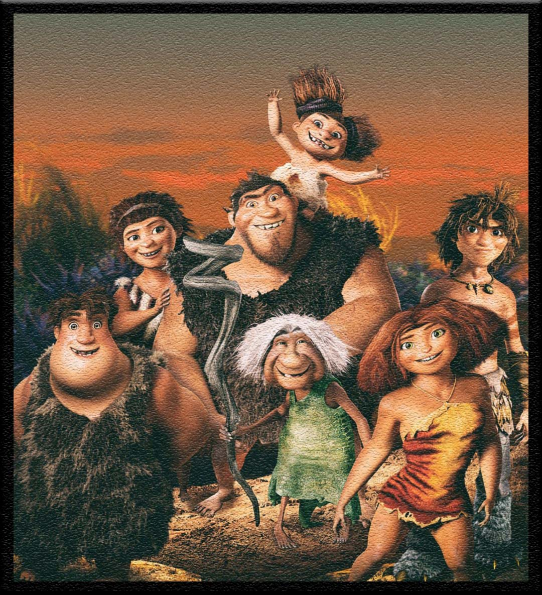
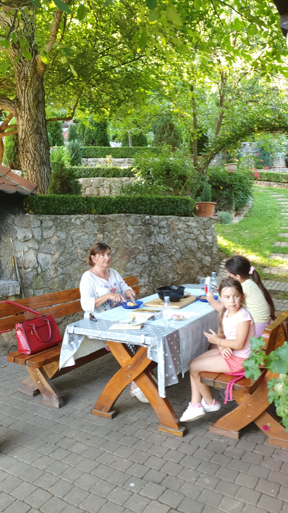

# **MMM** 

### Backend Development Milestone Project 3, using my own idea MMM: Mom's Micro Manager for the whole family and all the needs of one in one place.

 
---
---
## **Content Tree**
---
---

- [UX](#ux)
    - [Owner goals](#owner-goals)
    - [User goals](#user-goals)
    - [Structure of the website](#structure-of-the-website)
    - [Wireframes](#wireframes)
    - [Surface](#surface)
- [Features](#features)
  - [Game Page](#game-page)
  - [Features Left to Implement](#features-left-to-implement)
- [Technologies Used](#technologies-used)
- [Testing](#testing)
    - [Issues during codeing](#issues-during-coding)
    - [Functionality testing](#functionality-testing)
    - [Compatibility testing](#compatibility-testing)
    - [Performance testing](#performance-testing)
- [Deployment](#deployment)
- [Screenshot](#screenshot)
- [Credits](#credits)
---
---
## UX
---
---
## Owner goals
---
#### Goal was to build simple task managment for biger and more active families
* To increase the number of participants in MMM's daily tasking by providing 
  a simple, easy to use application.
* By doing that it easier to see biger picture, of immportance to each member
* Make easier day to day's taks in evrydays life of grown ups.
* Better control of your own time and all the task that we all need to perform on daily basis
* Ps. even tho i started as cookbook, i realized it a bit to complicated so i change it to somehting more simpler = mom's micro managment
---
## User goals
---
### As for user goals, it quite similar to the owners one!
   * to have better control over you own time and entire family
   * more happiness less stressing
   * more free time and beter organization on using this managment system
   * the ability to log all family members to MMM, and hence simpler control of all tasks of all members  
   * each member can make their own acc and add their own tasks to be done

## **Structure of the website**
---
The task managment MMM is designed to be minimalistictic, with cleans and simple outlook. 
Inuitive and easy to understand.

## **Wireframes**
---
* I used website [Wireframe.cc](https://wireframe.cc/ob6oIW) to create a wireframes, with addition of Photoshop ofc.

  

## **Surface**
---

### Colors
Main colours:
* trying to keep all in few tones
* header: orange darken-1 color with white text + text-shadow: 2px 2px 2px rgba(0, 0, 0, 0.5);
* 4 type of buttons: 

                     done - green
                     edite/add task - orange
                     reset/delete - red
                     research/add category - blue

* add task interface - gray
* footer = white-text + text-shadow on redish background color

### Fonts 
   1. Bangers = [Google Fonts Library](https://fonts.google.com/) 
   2. sans-serif as a backup!
   3. Verdana = as default
   
### Images

* Images from Google will be all credite in [credits](#credits) section.

 

[Back to Content Tree](#content-tree)

---
---
## Features
---
---

### The website contains One pages. 

### **Game page** 
*  one page where game is centred on page, vertically and horizontally
*  contains game window (20x20 tails) where "znake" is moving in search of "food" 
*  the result label is in the upper right corner
*  title name slightly above the game "Znake"
*  reset button game for restarting the game form start it under Znake title

### **Features Left to Implement**
* defenetly more levels with higer speed or harder dificolty in some maners
* some type of star scoring: so players can leav 1-5 star grade
* it will be nice to make the same game in 3D environment
* implement way more different context, just for practise and it will make game more hi-tech and more attractive!
* implement score name options - leaderboard
* make it multiplayer!!

---
---
## **Technologies Used**
---
---
### **Core structure**
* HTML5

### **Style language**
* CSS

### **Interactions**
* All interactions are done by Java Script

### **Fonts**
* Bangers  [Google Fonts Library](https://fonts.google.com/)  
  
### **Storage**
* GitHub - As a software hosting platform to keep project in a remote location.

### **Coding platform**
* Gitpod - As a development hosting platform.

### Wireframe.cc
* Making sketches and layout of the project.

### [Lighthouse](https://developers.google.com/web/tools/lighthouse)
* Tool to check performance of the website

### **Image editor**
* Photoshop
* [Am i responsive](http://ami.responsivedesign.is/#)

[Back to Content Tree](#content-tree)

---
---
## **Testing**
---
---

### **Functionality testing** 

  * since it a simple game...

### **Compatibility testing**
 It was made originaly only for keyboard platform, compability testing was smooth  on all similar platforms with keyboard.

### **Performance testing**
---
  I run [Lighthouse](https://developers.google.com/web/tools/lighthouse) tool to check performance of the website. Screenshots are presented below:
    
   

   
* Unfortunately, PWA did not pass since i was building the game for keyboard devices only, desktop computers. 
   

### Issues during site development
---
* To be honest, since i was following youtube video only issues was TYPO mistakes. And that usually consume a lot of time and discourages, only to eventually find that the code is good, but it has one letter of excess or missing semicolon that makes the whole code incorrectly.   
* Some of them was me trying to figure it out, how is evrything behave in inspector view., example of grid system

  
getting familiar how tiels and ticks work trough inspector options

* New/old issues appears this morning again, this types are actually consistent during entire time working on this project.
  * it not so bad, since it usualy last around 20-30min and then goes away, so im not sure is it lag issues, servers., one of examples below.
  
     
    * sometimes can be quite progres killer, since it shows wrong inputs. And the same code doesn't work any more as it supposed to.

  [Back to Content Tree](#content-tree)
---
---
## **Deployment**
---
---
The project was deployed on GitHub Pages. I used Gitpod as a development environment where I commited all changes to github. I used push command in Gitpod to save changes into GitHub.
* ###   Your site is published at https://github.com/danthestar/MS2

---
---
## **Credits**
---
---
   
####  To complete this project I used Code Institute student template: [gitpod-full-template](https://github.com/Code-Institute-Org/gitpod-full-template)

### **Idea**
* In the beginning i wasn't sure what, how or where to start: what game to make and what style to pick.
  * after consulting my self with student suppoort and my mentor Adegbenga Adeye, i agree with them to stick to something simple
  * so since my entire reason to start doing coding was to be able to start doing in game development or application development, snake game was best pick
* **But since this is my first JS actual coding**, i needed a model that i can follow and understand, those bellow are some of my picks form where i was able to recreate my Znake game
    
  * i try my best to not use same names as the source of my code, so by doing that i hope i avoid at least some of copy/paste related issues confronting forms about violation of use someone's code
  * and it also beneficial for me if i change all the names - so i can use more of my own thinking in order to figure it out how the code operates
  1. [Web Dev Simplified ](https://www.youtube.com/watch?v=QTcIXok9wNY&t=27s) = How To Code The Snake Game In Javascript (code with him seams way simpler :D)
  2. [Coding With Adam](https://www.youtube.com/watch?v=7Azlj0f9vas&t=745s) = Coding Snake in JavaScript Complete Tutorial Every Step Explained with HTML5 Canvas (i was following thi one as my main source of code)
  3. [Franks laboratory](https://www.youtube.com/watch?v=jl29qI62XPg&t=1477s) = JavaScript 2D Game Tutorial (visual enrichment)

### **Content**
* The base for main structure in similar to structuro of [Coding With Adam](https://www.youtube.com/watch?v=7Azlj0f9vas&t=745s) from where i take mouste of it
* Readme file inspirations are my previous md.file 
  * [danthestar/the-mandalorian](https://github.com/danthestar/the-mandalorian/blob/master/README.md) on GitHub
  

### **Media**

* **all others links that i have used as inspiration or understanding how can i make something:**
   * [Web Dev Simplified ](https://www.youtube.com/watch?v=QTcIXok9wNY&t=27s) inspirations for coding development = especially in game department
   * [Coding With Adam](https://www.youtube.com/watch?v=7Azlj0f9vas&t=745s) inspirations for coding development = especially in game department
   * [Franks laboratory](https://www.youtube.com/watch?v=jl29qI62XPg&t=1477s) inspirations for coding development = especially in game department
   * [KnifeCircus](https://www.youtube.com/watch?v=bG2BmmYr9NQ&t=5s) inspirations for coding development = especially in game department

* **jpg files** all my photos are Photoshoped after being downloaded form free source
     * 1.      
     * 2. 
     * 3.   
     * 4.  

  ## [Back to Content Tree](#content-tree) 

---
---
## **Screenshot**
---
---
   
---
### **Acknowledgements**
---
* **Special Thanks to:**
    * my Mentor - **Adegbenga Adeye**.
    * all the **Tutor Assistance** 
    * **HUGE** thanks to all girls and guys in the **[Slack Community](https://slack.com/intl/en-ie/)** for providing response for each of my query.
    * **Student Care** for constant care and providers of usuefull additional information out side of follow lectures
    * Troubleshooting Tips - it a handy
    * youtube content creators
    * and everyone else who supports me on this Coding journey
--- 
---
---
## Testing
---
---
### Issues during codeing
---
#### On following "Mini Project | Putting It All Together" i run into small issues thta wa sopening my previw like this:
   .png)
   #### Fixed by cheking original code and copy paste it to match the origin
   .png)
   #### **Still not sure way wasnt working properly (maybe becouse new updates on page it self) [< cdnjs >](https://cdnjs.com/libraries/font-awesome)**

[Back to Content Tree](#content-tree)
### *Daniel Matasic*
