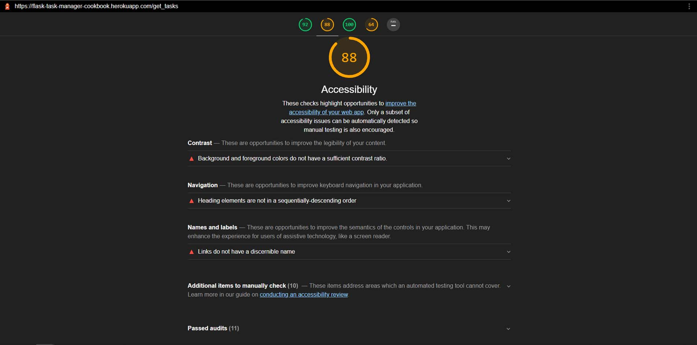

# **MMM** 

### Backend Development Milestone Project 3, using my own idea MMM: Mom's Micro Manager for the whole family and all the needs of one in one place.

 

###  *The live Website can be found [here.](https://flask-task-manager-cookbook.herokuapp.com/login)*
---
---
## **Content Tree**
---
---

- [UX](#ux)
    - [Idea](#idea)
    - [Owner goals](#owner-goals)
    - [User goals](#user-goals)
    - [Structure of the website](#structure-of-the-website)
    - [Wireframes](#wireframes)
    - [Surface](#surface)
- [Features](#features)
  - [Game Page](#game-page)
  - [Features Left to Implement](#features-left-to-implement)
- [Technologies Used](#technologies-used)
- [Testing](#testing)
    - [Issues during codeing](#issues-during-coding)
    - [Compatibility testing](#compatibility-testing)
    - [Performance testing](#performance-testing)
- [Deployment](#deployment)
- [Credits](#credits)
    - [Acknowledgements](#acknowledgements)

---
---
## UX
---
---
### **Idea**
    In the beginning i wasn't sure what, how or where to start: since code it self was so overwelming and still for me so hard to be abe to produce purly somehting on my own.

    after retrying for 2 time the same taks, i decided to go with mini project = and folowing step by step, changing only stayling of it. the main core is the same as in mini project|Puting It All Togheter.

    So since my entire reason to start doing coding was to be able to start doing in game   development or application development, i understand know that i need allot of practice in order to master all of the interactions: JavaScript, Python+Flask, MongoDB, Heroku + CRUD functionality.
 
**But since this is my first MS3**, and it way more complicated and needs way more focus i needed a model that i can follow and understand, so thats way i decided to go with mini project|Puting It All Togheter as example.
      
    I try my best to not use same names as the source of my code, so by doing that i hope i avoid at least some of related issues confronting forms about violation of use Plagiarism Policy.

    Satying that i was still not being able to digress far form core code = it so many tiny options to make a mistake or simply typo mistakes and code isnt working again. 
## Owner goals
---
#### Goal was to build simple task managment for biger and more active families
* To increase the number of participants in MMM's daily tasking by providing 
  a simple, easy to use application.
* By doing that it easier to see biger picture, of immportance to each member
* Make easier day to day's taks in evrydays life of grown ups.
* Better control of your own time and all the task that we all need to perform on daily basis
* Ps. even tho i started as cookbook, i realized it a bit to complicated so i change it to somehting more simpler = mom's micro managment
---
## User goals
---
### As for user goals, it quite similar to the owners one!
   * to have better control over you own time and entire family
   * more happiness less stressing
   * more free time and beter organization on using this managment system
   * the ability to log all family members to MMM, and hence simpler control of all tasks of all members  
   * each member can make their own acc and add their own tasks to be done

## **Structure of the website**
---
The task managment MMM is designed to be minimalistictic, with cleans and simple outlook. 
Inuitive and easy to understand.

## **Wireframes**
---
* I used website [Wireframe.cc](https://wireframe.cc/ob6oIW) to create a wireframes, with addition of Photoshop ofc.

Home
  
Log in

New task
  
Manage Categories

## **Surface**
---

### Colors
Main colours:
* trying to keep all in few tones
* header: orange darken-1 color with white text + text-shadow: 2px 2px 2px rgba(0, 0, 0, 0.5);
* 4 type of buttons: 

                     done - green
                     edite/add task - orange
                     reset/delete - red
                     research/add category - blue

* add task interface - gray
* footer = white-text + text-shadow on redish background color

### Fonts 
   1. font-family: -apple-system,BlinkMacSystemFont,"Segoe UI",Roboto,Oxygen-Sans,Ubuntu,Cantarell,"Helvetica Neue",sans-serif;
   
### Images

* Images will be all credite in [credits](#credits) section.

[Back to Content Tree](#content-tree)

---
---
## Features
---
---

### The website contains 7 pages. 

#### **Home page** 
*  page where you see all tasks donr by evrybody in family
#### **Profile page**
*  page where you chekc your profile 
#### **New Taks page**
*  page where you can add new task: pick category, add task name, add task description, pick date of task and marks it as important! 
#### **Manage Categories page**
*  page where you can add new cathegory for your task page 
#### **Log Out/Log In page**
*  page for loging out and in on MMM

### **Features Left to Implement**
---

  * add more info to profile page 
  * make it more apealing to generale taste - visualy speaking
  * adding gps navigation/location for each user
---
---
## **Technologies Used**
---
---
### **Core structure**
* HTML5

### **Style language**
* CSS

### **Interactions**
* JavaScript, Python+Flask, MongoDB, Heroku + CRUD functionality

### **Fonts**
### [Materialize](https://materializecss.com/about.html) 
* Font-family: -apple-system,BlinkMacSystemFont,"Segoe UI",Roboto,Oxygen-Sans,Ubuntu,Cantarell,"Helvetica Neue",sans-serif;   

### Wireframe.cc
* Making sketches and layout of the project.

### [Lighthouse](https://developers.google.com/web/tools/lighthouse)
* Tool to check performance of the website

### **Image editor**
* Photoshop
* [Am i responsive](http://ami.responsivedesign.is/#)

### **Storage**
* GitHub - As a software hosting platform to keep project in a remote location.

### **Coding platform**
* Gitpod - As a development hosting platform.

### **Deployment platform**
* Heroku - As a Deployment platform.

###  **The live Website can be found [here.](https://danthestar.github.io/MS3-cookbook/)**

[Back to Content Tree](#content-tree)

---
---
## **Testing**
---
---

### **Compatibility testing**
    Works with no bugs on all my laptops and smartphones in my family and beyond, 
    although we all have a samsung smartphone (some version and type)

### **Performance testing**

  I run [Lighthouse](https://developers.google.com/web/tools/lighthouse) tool to check performance of the website. Screenshots are presented below:

  

  
  #### I'm never on same page with accessibility vote, as artist and industrial designer i 
  do some things on purpose: for visual apealing or becouse of complementary contrast;
  even though i agree that i didnt do nothing specila with visual effects, but less it always more.
  

  

  
### **Issues during site development**
---

    Main issue is stil typo mistakes   
    Some of them was me trying to figure it out, how is evrything behave in inspector view., example of grid system.

  [Back to Content Tree](#content-tree)

---
---
## **Deployment**
---
---
The project was deployed on GitHub Pages. I used Gitpod as a development environment where I commited all changes to github. I used "git commands" in Gitpod to save changes into GitHub and push site in public.
* ###   My site is published at https://danthestar.github.io/MS3-cookbook/
* ###  *The live Website can be found [here at heroku.com](https://flask-task-manager-cookbook.herokuapp.com/login)*

---
---
## **Credits**
---
---
   
####  To complete this project I used Code Institute student template: [gitpod-full-template](https://github.com/Code-Institute-Org/gitpod-full-template)

* **jpg files** all my photos are Photoshoped after being downloaded form free source

    ,
          

  ## [Back to Content Tree](#content-tree) 

### **Acknowledgements**
---
* **Special Thanks to:**
    * my Mentor - **Adegbenga Adeye**.
    * all the **Tutor Assistance** 
    * **HUGE** thanks to all girls and guys in the **[Slack Community](https://slack.com/intl/en-ie/)** for providing response for each of my query.
    * **Student Care** for constant care and providers of usuefull additional information out side of follow lectures
    * Troubleshooting Tips - it a handy
    * youtube content creators
    * and everyone else who supports me on this Coding journey
--- 
---

[Back to Content Tree](#content-tree)
### *Daniel Matasic*
