# **MMM Full Testing** 

 

###  *The live Website can be found [here.](https://flask-task-manager-cookbook.herokuapp.com/login)*
---
---
## **Testing Tree**
---
---

- [Testing](#testing)
    - [HTML](#html)
    - [CSS](#css)
    - [JS](#js)
    - [Python](#python)
    - [Compatibility testing](#compatibility-testing)
       - [Mozilla Firefox](#mozilla-firefox)
       - [Opera](#opera)
       - [Google Chrome](#google-chrome)
       - [Microsoft Edge](#microsoft-edge)
- [General testing](#general-testing)
  - [Navigation](#navigation)
  - [Page Load](#page-load)

---
---
### **Testing**
---
---

### **HTML**
---
Css Code runn trough [W3C HTML Validator](https://validator.w3.org/#validate_by_input), PASS obtaine after fixing error.

**Error**

 

**Pass**  by fixing 
 
 

[Back to Testing Tree](#testing-tree)

### **CSS**
---
Css Code runn trough [W3C CSS Validator](https://jigsaw.w3.org/css-validator/#validate_by_input+with_options), PASS obtaine after fixing error.

**Error**

 

**Pass**  by fixing missing px on 2px: line
 
 

 [Back to Testing Tree](#testing-tree)

 ### **JS**
---
JS Code runn trough [jshint Validator](https://jshint.com/), PASS obtaine after fixing error.

**Error**

 

**Better** by changing some parameters
 
 

[Back to Testing Tree](#testing-tree)

### **Python**
---
Python Code runn trough [PEP8 Validator](http://pep8online.com/), PASS obtaine after fixing error.

**Error**

 

**Pass**  by fixing blank lines, and since it seems that "trailing whitespace" is not mistake in first place

[Back to Testing Tree](#testing-tree)

---
---
### **Compatibility testing**
---
---

### **Mozilla Firefox**
    Works as intended on Mozilla Firefox in big screen, tablet mode and phone mode so we can test "hamburger" menu. No issues at all.
**Medium size screen**
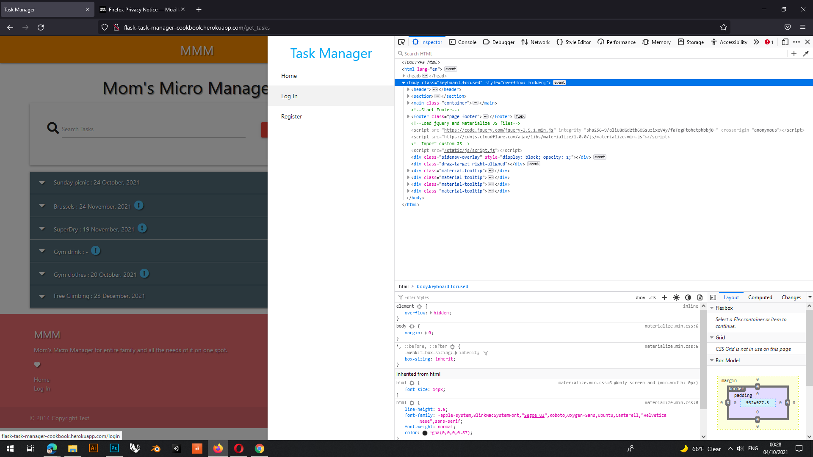

**Big size screen**
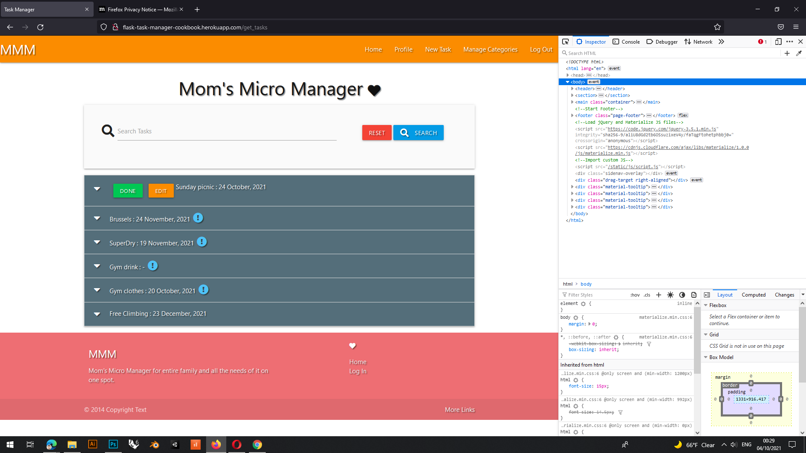

**Smartphone size screen**
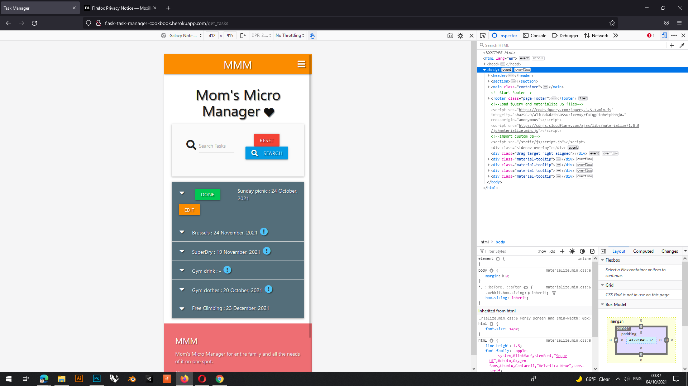

[Back to Testing Tree](#testing-tree)

### **Opera**
    Works as intended on Opera in big screen, tablet mode and phone mode so we can test "hamburger" menu. No issues at all.

**Big size screen**
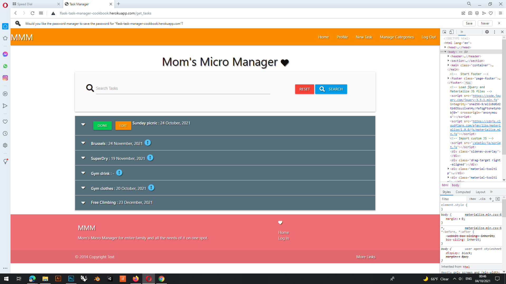

**Medium size screen**
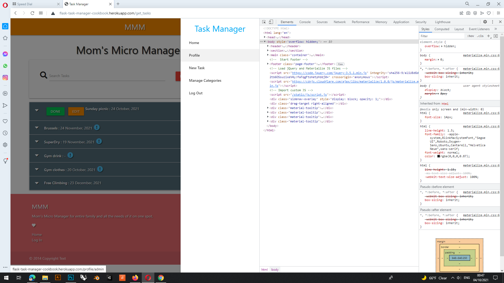

**Smartphone size screen**

[Back to Testing Tree](#testing-tree)

### **Google Chrome**
    Works as intended on Google Chrome in big screen, tablet mode and phone mode so we can test "hamburger" menu. No issues at all.
**Big size screen**
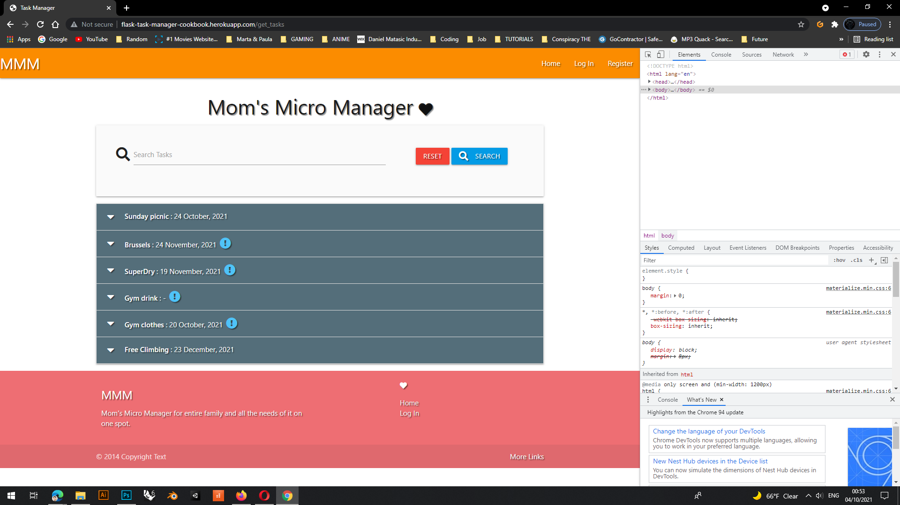
**Medium size screen**
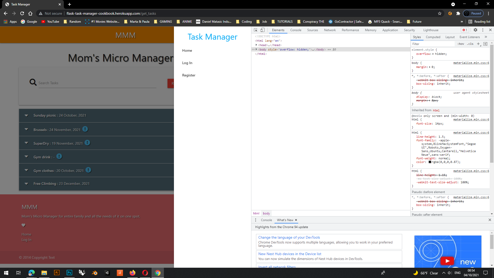
**Smartphone size screen**
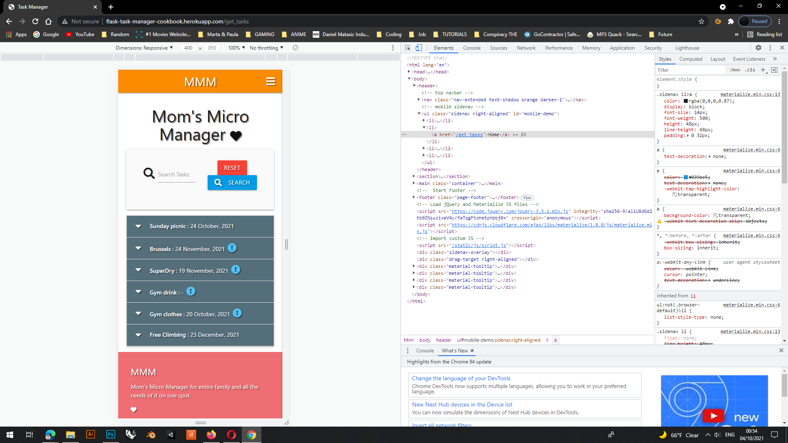

[Back to Testing Tree](#testing-tree)

### **Microsoft Edge**
    Works as intended on Microsoft Edge in big screen, tablet mode and phone mode so we can test "hamburger" menu. No issues at all.
**Big size screen**
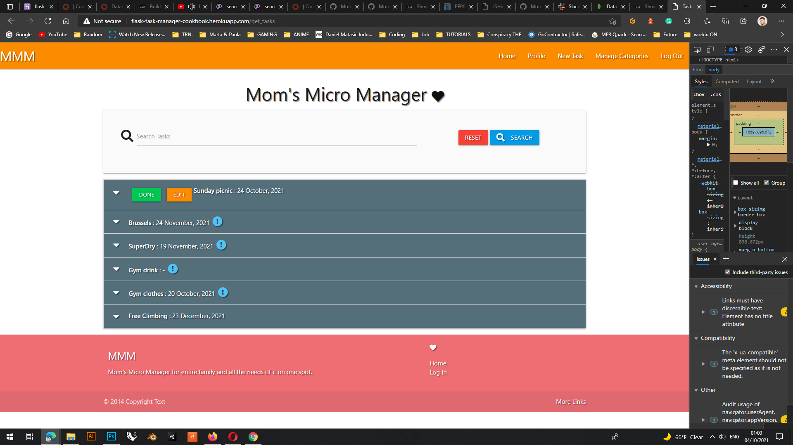
**Medium size screen**
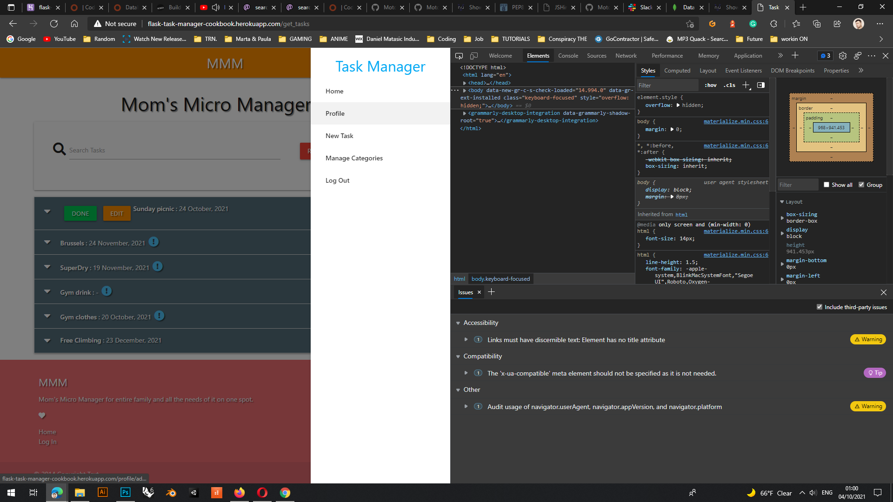
**Smartphone size screen**
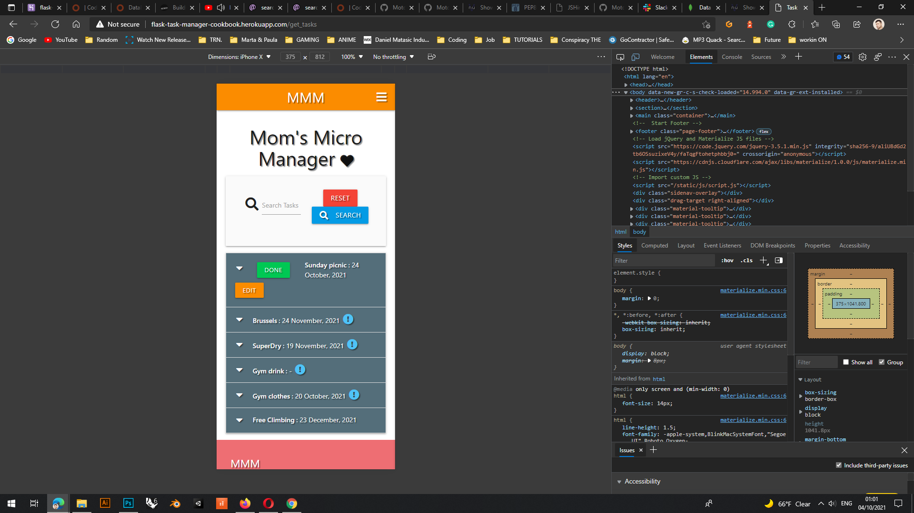

[Back to Testing Tree](#testing-tree)

---
---
### **General testing**
---
---

### **Navigation**
---
*Navigation part of testing will be concerned about all pages and how are they working.
On opening application we have Working Home, Log In and Register option is in the header. The addition is searching tab, and reset of the same search tab.*

    All pages are working accordingly to the blueprint. 
    As Admin user on all platforms (Edge, Google Chrome, Firefox and Opera) there is no issues. 
    Same goes for Users, everything is working as planned.
    Home / Profile / New Taks / Manage Categories

#### **Page Load**
---
Log In button, Sign Out or Register options are working with no issues.

    By clicking on Log In button we will be transfred to Log In / Register options.
    On logging in we will be automatically moved to a Profile page, from where we can navigate to:

**Home** 

    - we have visual data of all tasks made by all family members
    
**Profile** 
    
    - still stays the profile

**New Task** 
     
    - opens new Html with functions of creating  a task: having options as Category, Task Name, Task Description, Date and Urgent slider (in case it important tasks and it can not be passed).

**Manage Categories**
    
    - option is available only for Admin users, since he is the one that will be managing all the needs.
    It allows Admin users to create new categories for all future adventures of the Family. 

**Log Out**

     - on log out in we will be automatically moved to a Log In/Register page.

[Back to Testing Tree](#testing-tree)

### *Daniel Matasic*

