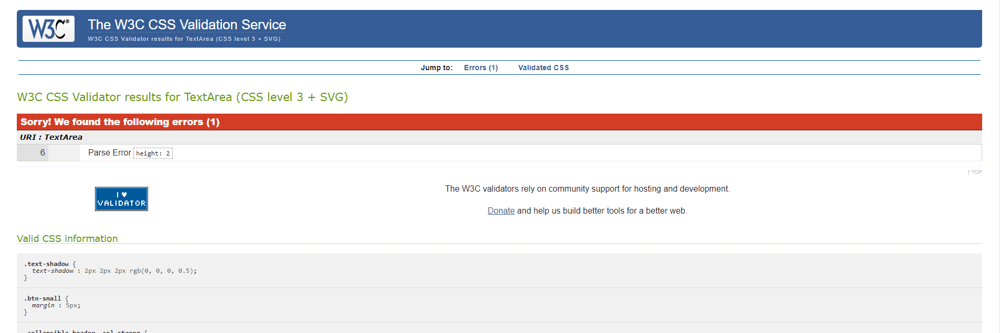
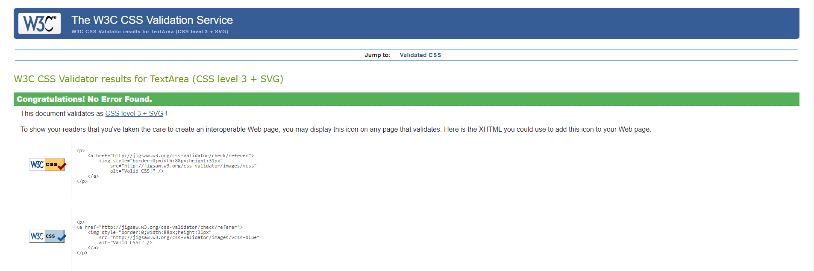
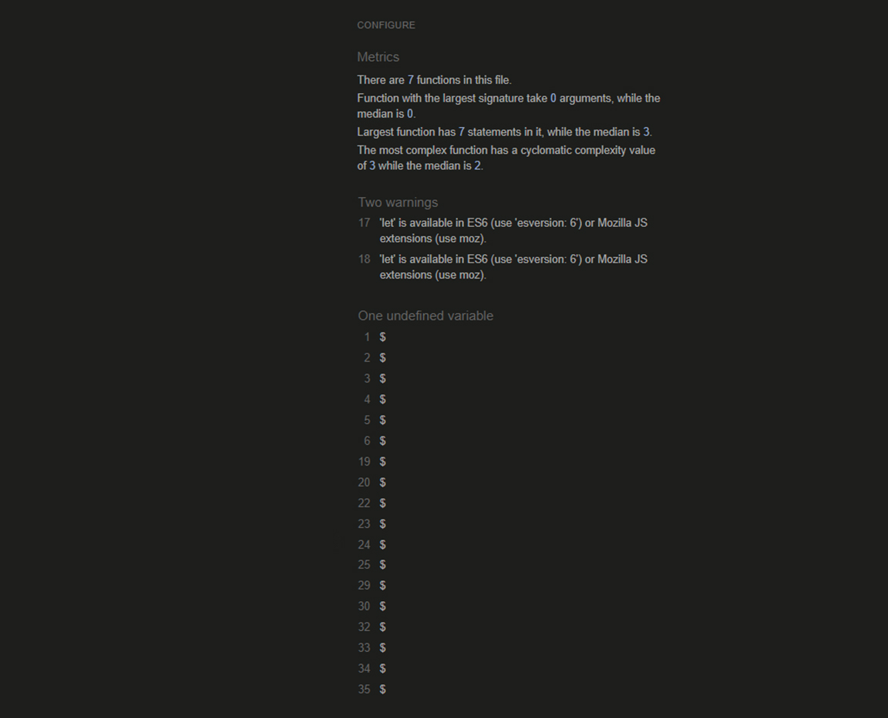
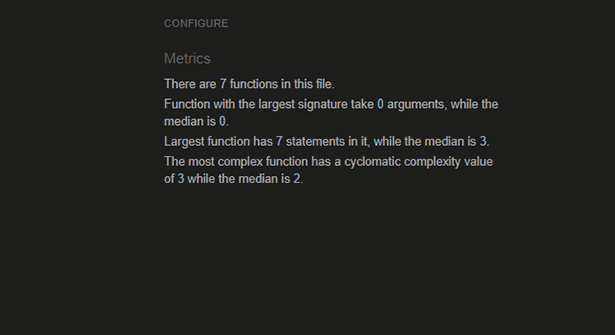
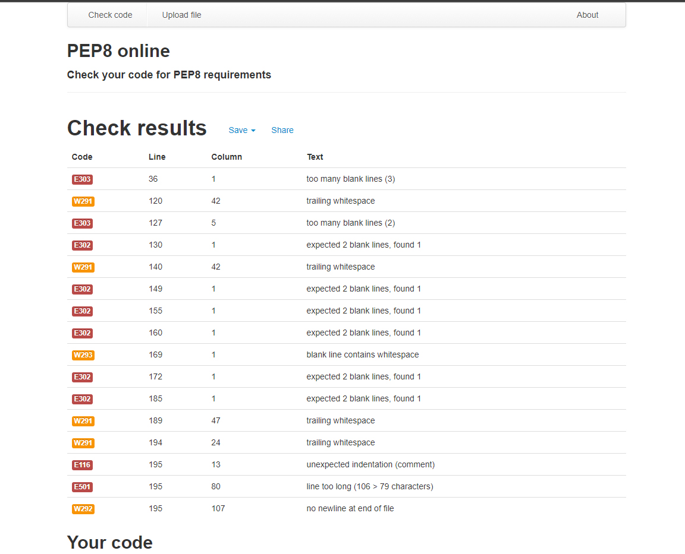
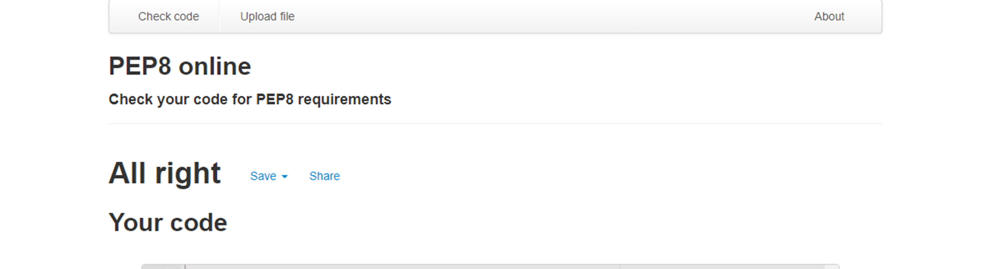

# **MMM Full Testing** 

 

###  *The live Website can be found [here.](https://flask-task-manager-cookbook.herokuapp.com/login)*
---
---
## **Testing Tree**
---
---

- [Testing](#testing)
    - [HTML](#html)
    - [CSS](#css)
    - [JS](#js)
    - [Python](#python)
    - [Compatibility testing](#compatibility-testing)
    
- [Features](#features)
  - [Layout](#layout)

---
---
### **Testing**
---
---

### **HTML**
---
Css Code runn trough [W3C HTML Validator](https://validator.w3.org/#validate_by_input), PASS obtaine after fixing error.

**Error**

 

**Pass**  by fixing 
 
 

[Back to Testing Tree](#testing-tree)

### **CSS**
---
Css Code runn trough [W3C CSS Validator](https://jigsaw.w3.org/css-validator/#validate_by_input+with_options), PASS obtaine after fixing error.

**Error**

 

**Pass**  by fixing missing px on 2px: line
 
 

 [Back to Testing Tree](#testing-tree)

 ### **JS**
---
JS Code runn trough [jshint Validator](https://jshint.com/), PASS obtaine after fixing error.

**Error**

 

**Better** by changing some parameters
 
 

[Back to Testing Tree](#testing-tree)

### **Python**
---
Python Code runn trough [PEP8 Validator](http://pep8online.com/), PASS obtaine after fixing error.

**Error**

 

**Pass**  by fixing blank lines, and since it seems that "trailing whitespace" is not mistake in first place

---
---
### **Compatibility testing**
---
---

    Works with no bugs on all my laptops and smartphones in my family and beyond, 
    although we all have a samsung smartphone (some version and type)

[Back to Testing Tree](#testing-tree)

### *Daniel Matasic*

