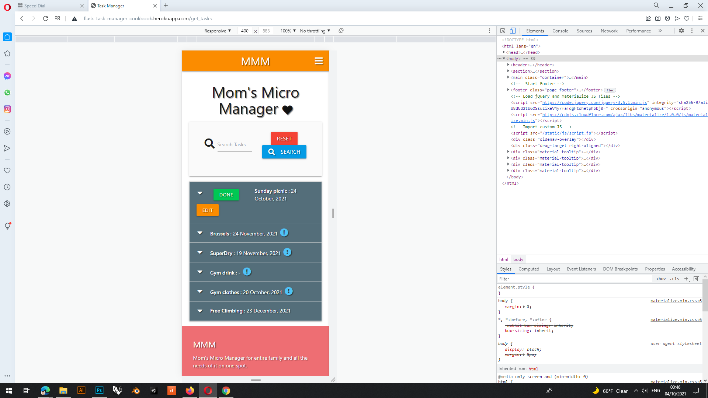

# **MMM Full Testing** 

 

###  *The live Website can be found [here.](https://flask-task-manager-cookbook.herokuapp.com/login)*
---
---
## **Testing Tree**
---
---

- [Testing](#testing)
    - [HTML](#html)
    - [CSS](#css)
    - [JS](#js)
    - [Python](#python)
    - [Compatibility testing](#compatibility-testing)
       - [Mozilla Firefox](#mozilla-firefox)
       - [Opera](#opera)
       - [Google Chrome](#google-chrome)
       - [Microsoft Edge](#microsoft-edge)
- [General testing](#general-testing)
  - [Navigation](#navigation)

---
---
### **Testing**
---
---

### **HTML**
---
Css Code runn trough [W3C HTML Validator](https://validator.w3.org/#validate_by_input), PASS obtaine after fixing error.

**Error**

 

**Pass**  by fixing 
 
 

[Back to Testing Tree](#testing-tree)

### **CSS**
---
Css Code runn trough [W3C CSS Validator](https://jigsaw.w3.org/css-validator/#validate_by_input+with_options), PASS obtaine after fixing error.

**Error**

 

**Pass**  by fixing missing px on 2px: line
 
 

 [Back to Testing Tree](#testing-tree)

 ### **JS**
---
JS Code runn trough [jshint Validator](https://jshint.com/), PASS obtaine after fixing error.

**Error**

 

**Better** by changing some parameters
 
 

[Back to Testing Tree](#testing-tree)

### **Python**
---
Python Code runn trough [PEP8 Validator](http://pep8online.com/), PASS obtaine after fixing error.

**Error**

 

**Pass**  by fixing blank lines, and since it seems that "trailing whitespace" is not mistake in first place

[Back to Testing Tree](#testing-tree)

---
---
### **Compatibility testing**
---
---

### **Mozilla Firefox**
    Works as intended on Mozilla Firefox in big screen, tablet mode and phone mode so we can test "hamburger" menu. No issues at all.
**Medium size screen**

**Big size screen**

**Smartphone size screen**

[Back to Testing Tree](#testing-tree)

### **Opera**
    Works as intended on Opera in big screen, tablet mode and phone mode so we can test "hamburger" menu. No issues at all.

**Big size screen**

**Medium size screen**

**Smartphone size screen**

[Back to Testing Tree](#testing-tree)

### **Google Chrome**
    Works as intended on Google Chrome in big screen, tablet mode and phone mode so we can test "hamburger" menu. No issues at all.
**Big size screen**

**Medium size screen**

**Smartphone size screen**

[Back to Testing Tree](#testing-tree)

### **Microsoft Edge**
    Works as intended on Microsoft Edge in big screen, tablet mode and phone mode so we can test "hamburger" menu. No issues at all.
**Big size screen**

**Medium size screen**

**Smartphone size screen**

[Back to Testing Tree](#testing-tree)

---
---
### **General testing**
---
---

### **Navigation**
---
Navigation part of testing 

### *Daniel Matasic*

